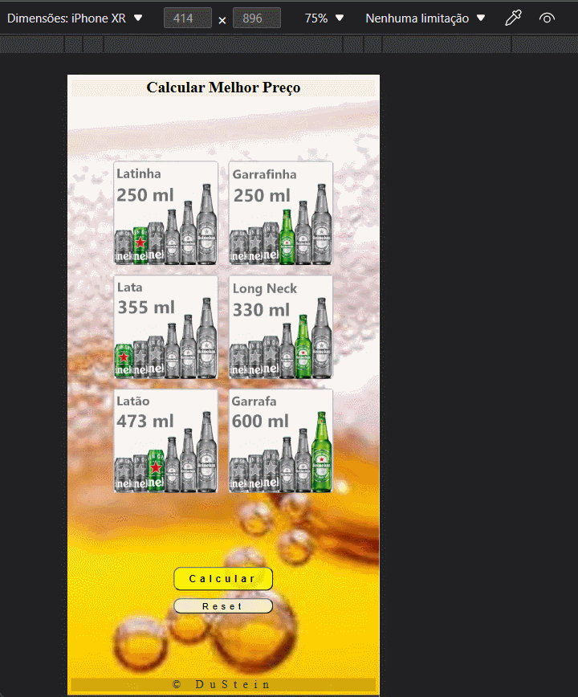

# Cerveja Preço x Litro

## Demo

## Funcionalidade
Aplicação para comparar o preço da mesma bebida oferecida em diferentes tamanhos de embalagens.
Aceita input do preço de cada tipo disponível, e calcula o preço por litro dos tipos que receberam input, retornando a embalagem cujo preço é o melhor custo benefício.

## Tecnologias
<table>
    <tr>
      <td align="center" height="108" width="108">
        
         <strong>HTML5</strong>
      </td>
      <td align="center" height="108" width="108">
        
         <strong>CSS3</strong>
      </td>
      <td align="center" height="108" width="108">
        
         <strong>JavaScript</strong>
      </td>
</table>
Desenvolvido em HTML, CSS e JavaScript puro.
